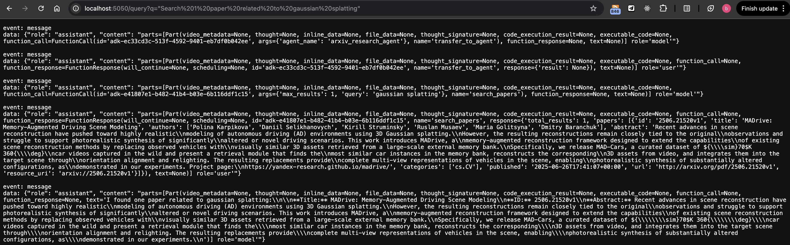

## Usage

First set the Google Gemeni API key:

```bash
export GOOGLE_API_KEY={API_KEY}
```

Then start the REST API server:

```python
python -m personal_agent
```

Then you can communicate through continuous api calls in the browser:




## TODO
* Add UI to demonstrate communications
